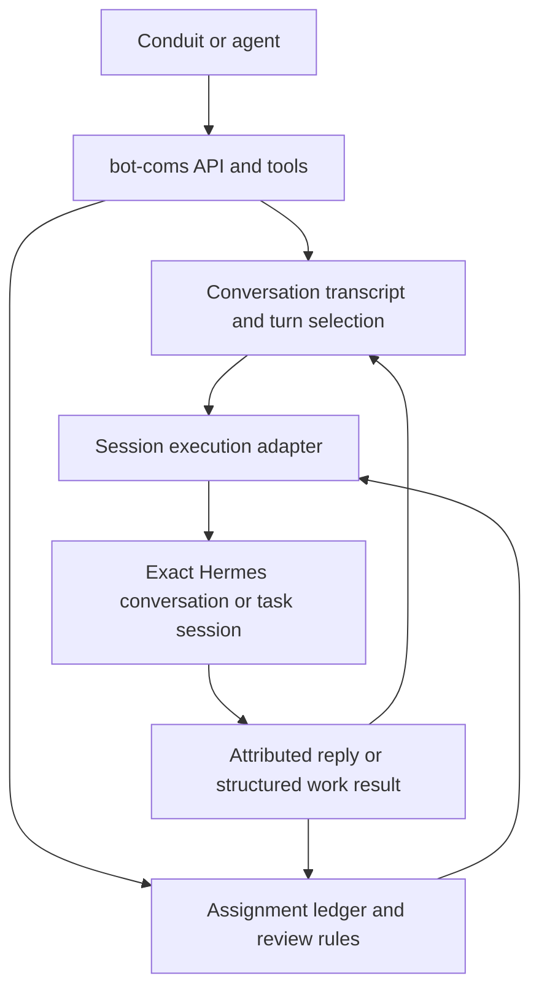
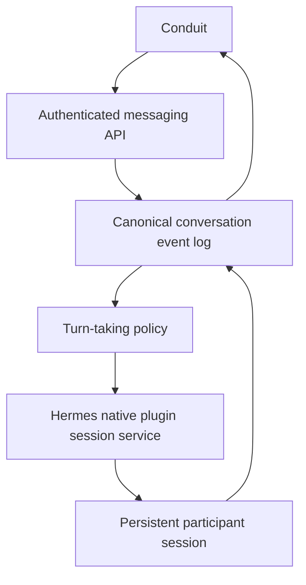

# Messaging runtime redesign

Date: 2026-09-09. Status: initial backend/session implementation staged and tested in isolated worktrees; no live runtime migration performed. Predictive turn selection is implemented in bot-coms (on-by-default aux selector; shadow remains available); Conduit UI states for speaking/waiting/yielded remain a follow-up.

## Required deployment: retain bot-coms without sidecars

Fresh sessions alone do not justify removing bot-coms. Retain its API and useful messaging/workflow behavior, including assignment ownership, review gates, and durable recovery. The user requires no launchd sidecars: scheduling, dispatch, and reconciliation must run under the existing Hermes backend lifecycle from the first delivered replacement. Session reuse and execution integration are both required; retaining standalone workers is not an acceptable first version.

There are three distinct changes; the first and third are required together for the initial replacement:

| Change | What it buys | Requires removing bot-coms? |
| --- | --- | --- |
| Reuse exact Hermes sessions | Conversation and task continuity; less repeated initialization | No |
| Select useful conversational turns before execution | Fewer unnecessary replies and agent runs | No |
| Consolidate execution into Hermes's existing service | No separately supervised messaging or team-wake processes | No; bot-coms can keep its product and workflow responsibilities |

The practical proposed flow is:

The execution adapter uses a supported integration with the existing Hermes session service. No separate messaging worker, team wake supervisor, or reconciliation daemon is installed or required. The existing Hermes backend starts the service, scans durable work inside its tracked lifecycle, reconciles unfinished work on startup, and owns shutdown. Background tasks or threads inside that backend are implementation details, not separately managed services. Bot-coms remains responsible for durable delivery and workflow state until an explicit migration transfers each responsibility; an execution API does not implicitly replace an outbox or task ledger.

For messaging, bind `(server, principal, conversation, profile)` to an exact durable session ID. For team work, bind the assignment identity and participating peer to a task session, with explicit handling for reassignment generations. Resume an existing coding-agent job when appropriate through the existing runner. Keep unrelated assignments and private conversations separate. Do not use a profile-wide latest-session flag.

Persist the session binding before subsequent dispatches can race. Append only unseen context, serialize writes to a bound session, and reconcile uncertain execution before retrying. These are bounded changes to the existing design, not grounds for a wholesale replacement. Fresh process startup and fresh conversation state are separate: a CLI process can resume a durable conversation.

Turn-taking applies to open discussion. Assignment, report, required review, and acceptance events follow explicit workflow rules. A classifier must never suppress a required review or treat conversational agreement as acceptance.

The sections below describe the inspected current implementation and the integrated target. Reuse the existing Hermes execution and recovery machinery while retaining bot-coms policy and compatibility where useful. Durable transcript ownership must be explicitly migrated if moved into Hermes; do not create competing writable logs. Predictive group selection can follow the initial integrated session execution.

## Integrated target

Conduit messaging uses Hermes's existing conversation execution service through bot-coms. Retire the separately supervised bot-coms messaging worker, team wake runner, and any separate reconciliation scheduler as part of cutover. Eliminate redundant local dispatch spool state once its delivery guarantees are covered by the integrated service. Preserve durable conversations and reuse one Hermes session for each conversation participant. Add turn-taking selection before expensive agent execution.

## Baseline inspected before implementation

Conduit calls `/api/plugins/bot-coms-messaging/v1`. The plugin saves messages and dispatches in SQLite. Its separate worker polls, publishes dispatch references into a bot-coms file spool, claims those references, and starts `hermes -p <profile> chat --in ~ -Q --query-file ...` for each reply.

The worker explicitly excludes `--continue` and `--resume`. Every run receives a JSON reconstruction of at most 100 messages, bounded to 48,000 body characters. Only final quiet-mode stdout becomes a public reply. The dispatch schema has no persistent Hermes session binding. This preserves the public transcript but loses native session continuity between replies.

The per-profile file lease also serializes unrelated conversations using that profile. Multiple selected profiles can run concurrently against the same triggering message, without seeing one another's subsequent replies. User sends target explicit recipient IDs or the configured default responder. Bot reply mentions can trigger further runs, bounded by hop, wake, and cycle limits. These are routing rules, not conversational turn prediction.

The worker provides real guarantees: durable admission, authorization checks, cancellation, bounded execution, and protection against replaying ambiguous runs. Those responsibilities must survive its removal. SQLite and the spool currently represent overlapping delivery state; moving the same loop into an untracked HTTP background task would not solve that problem.

Evidence:

- [Conduit API client](/Users/jason/projects/hermes-conduit/Conduit/Services/MessagingService.swift:5)
- [Fresh-run execution and reconstructed context](/Users/jason/projects/bot-coms/src/bot_coms_messaging/worker.py:76)
- [Dispatch admission and recipient fallback](/Users/jason/projects/bot-coms/src/bot_coms_messaging/store.py:139)
- [Readiness currently depends on worker heartbeat](/Users/jason/projects/bot-coms/src/bot_coms_messaging/api.py:88)

The reported eight completed runs and 22:58 completion time are user-provided operational context; this review did not independently inspect the live run database.

## Reuse already present in Hermes

The local Hermes checkout already starts a hosted-room service during dashboard backend startup. That service has durable room events, fenced driver tasks, cancellation and recovery, and an in-process adapter to the same session handlers used by TUI/Desktop.

`HostedRoomServerRPC` supports session create/resume and `prompt.submit`, with hidden room sessions that do not close when a client disconnects. Its discussion policy tracks per-member watermarks and builds prompts from transcript deltas. The gateway also exposes `/v1/runs` with session IDs, idempotency keys, status, and events for transport-based execution.

Use the existing local session adapter for same-server execution. Use the existing gateway transport when execution crosses a server boundary. Do not introduce a third executor. These are verified source capabilities, not proof that the running installation has enabled or exercised every path.

Evidence:

- [Backend-owned service startup](/Users/jason/.hermes/hermes-agent/hermes_cli/web_server.py:166)
- [In-process session adapter](/Users/jason/.hermes/hermes-agent/tui_gateway/hosted_room_server_rpc.py:59)
- [Durable driver state](/Users/jason/.hermes/hermes-agent/gateway/hosted_room_driver.py:1)
- [Incremental member context](/Users/jason/.hermes/hermes-agent/gateway/hosted_room_discussion.py:507)
- [Gateway run admission](/Users/jason/.hermes/hermes-agent/gateway/platforms/api_server_runs.py:346)

## Intended ownership

Conduit owns presentation, drafts, sends, and user controls. The API owns authentication, authorization, idempotent admission, and compatibility. Hermes owns execution, lifecycle, recovery, and session state. Bot-coms can remain the messaging integration and inter-bot transport where needed; ordinary local replies should not require a second transport queue.

Keep the v1 namespace and bot-coms SQLite public transcript, dispatch queue, and workflow ledger. Hermes owns the native agent history and execution receipts; these have a different purpose from the shared public transcript. This implementation does not migrate business state into hosted rooms or introduce another public transcript.

The implementation adds `PluginContext.sessions` and a trusted backend facade with exact bindings, idempotent submit, status, cancellation, and reconciliation. It uses the existing native create/resume/prompt handlers. Authenticated plugin adapters enforce principal and profile access before invoking the facade; profile names and session IDs alone do not authorize a plugin request.

## Session identity and context

Bind each participant session to `(server, principal, conversation, profile)`. A DM has one bot binding; a group has one for every bot. A bot's private DM and group participation must use different sessions. Never resume the profile's globally latest session.

Reuse the durable session identity across turns and reconnects. Warm runtime objects may be retained or evicted by Hermes; a permanent process for every conversation is unnecessary. Track compression successors through native session identity handling.

Feed only newly committed shared messages to an existing participant session. Its own previous replies already exist in native history and must not be duplicated. Preserve authorship, stable message IDs, tool history, and provider role ordering. Record the exact delivered message IDs only with proven turn settlement; reconcile uncertain admissions before trying again. Keep system prompts and toolsets stable except for intentional native compression or explicit configuration transitions.

Session reuse should reduce repeated initialization and preserve context suitable for prompt caching. It does not make historical tokens free or guarantee a provider cache hit. Measure latency, prompt tokens, cached tokens where available, and tool initialization before claiming savings.

DMs and groups use the same native execution layer with existing bot-coms routing. They do not inherit hosted-room membership minimums. Per-message context tracking handles interleaved human messages without a scalar watermark skipping unseen input.

## Turn-Taking Prediction

For this text messaging design, prediction means deciding **whether a bot should respond, which bot, and when to yield to the human**. Voice end-of-utterance detection is a separate input signal if live voice joins these conversations later.

Use one conversation policy, not a model call to every member asking whether it wants to speak. Apply deterministic rules first. Invoke a small selector only when speaker choice is ambiguous. The selector receives a bounded, authorized transcript view, participant roles, unanswered requests, recent speaker history, and remaining discussion budget. It has no tools and cannot grant execution permission.

| Situation | Proposed behavior |
| --- | --- |
| DM message | Resume its bot session; no speaker-selection model needed. |
| Explicit recipient or reply to a bot | Select that bot. |
| “Hey guys!” in a group | One brief acknowledgement from the default responder, then yield. |
| Open Mora UI question | Select a relevant member, then reassess whether another contribution would add value. |
| Explicit request for everyone's views | Queue the requested members sequentially so later speakers see earlier replies. |
| Useful handoff | Select the addressed member if eligible and within budget. |
| Question addressed to the human | Yield; other bots should not answer on the human's behalf. |
| Nothing new to add | Settle without launching another agent. |
| New human message during a run | Record it immediately, invalidate pending speaker choices, and re-evaluate at a safe turn boundary; explicit Stop uses native cancellation. |

Persist each accepted decision with its input sequence, policy/model version, selected member or `yield`, reason code, and budget usage. Validate membership and authority outside the model. Reject stale decisions if the input sequence changes before admission. Recover from the persisted decision instead of asking the model again and potentially selecting another speaker.

Allow one conversational turn in flight per conversation by default. Human messages remain immediately admissible. Use explicit turn and cost limits per human input, and an inactivity deadline for temporary waiting; low confidence or selector failure should fall back to the configured responder for an unanswered human request, or yield after it has been answered. A selector score is not a calibrated probability without evaluation.

The existing Hermes policy already selects at most one task at a time, uses bounded rounds, and permits `(pass)`. However, an unmentioned first-round message selects every member, and passing still requires an agent run. Add selection before dispatch to avoid paying for predictable passes. Retain the existing durable driver and publication machinery.

Research supports exploring structured next-speaker selection, while showing selection bias remains a concern. These studies motivate evaluation; they do not validate this product policy. See [Nonomura and Mori, Who Speaks Next?](https://arxiv.org/abs/2412.04937) and [Mori et al., Analysing Next Speaker Prediction](https://aclanthology.org/2026.iwsds-1.8/).

## Migration and acceptance

1. Prove a DM through the existing Hermes session layer: two messages, one durable session, no replayed first-turn context, and completion while Conduit is disconnected. Verify principal and profile boundaries before exposing it through the plugin API.
2. Connect groups to the native session service with deterministic targeting first. Preserve conversation IDs, client message IDs, read state, membership, and the v1 response contract through explicit mappings.
3. Migrate each conversation under exclusive execution ownership. Drain or reconcile old running dispatches, import the public transcript once without triggering execution, and record a migration boundary. Start each native participant session with one bounded bootstrap context; never merge unrelated historical CLI sessions.
4. Cut over under exclusive execution ownership: stop old admission, drain or reconcile running work, transfer pending work, and activate the integrated Hermes executor. Remove the messaging launchd job and separate team-wake/reconciliation scheduling as part of that cutover. The delivered deployment must not require either executor to run as a sidecar. Rollback preserves post-cutover events and reconciles active work; it must not silently reinstall a sidecar.
5. Evaluate the selector in shadow mode on synthetic or explicitly selected examples, then enable it for ambiguous group turns if it improves usefulness and cost. Do not launch extra participant runs during shadow evaluation.
6. Update readiness to report the actual conversation service and execution capability. Update Conduit's setup instructions and expose speaking, waiting, queued, and needs-attention states. Add streaming as a compatible capability where useful.

Acceptance checks must cover duplicate sends, lost admission responses, restart after execution but before publication, simultaneous human messages, stale selection, permission revocation, cancellation, compression, disconnect/reconnect, and cross-conversation isolation. A run with uncertain side effects remains needs-attention until reconciled; an idempotent message receipt is not a guarantee of exactly-once tool execution.

Compare the old and new paths using completed-request latency, model calls per human input, prompt/cached tokens, duplicate replies, unwanted replies, missed explicit requests, and human overrides. The first delivery should establish persistent DM execution and shared ownership before adding predictive group behavior.

## Staged implementation and remaining verification

The matching source worktrees are:

- Hermes: `/private/tmp/hermes-bot-coms-session-service-20260909`
- bot-coms: `/private/tmp/bot-coms-backend-owned-20260909`
- coding-agent routing: `/private/tmp/hermes-team-ops-backend-routing-20260909`

The initial replacement keeps SQLite and the generic A2A claim/ack spool, eliminates
new messaging filesystem envelopes, and retires standalone messaging/wake commands.
The backend owns messaging scheduling, team scheduling, and reconciliation.
Conduit setup copy now requires this integration. Existing installed services and
configuration have not been changed.

Native tests use the real session handlers and SQLite with deterministic model
stubs; they do not establish live provider health. Cutover still requires draining
active work, backups, installing all matching changes, unloading old sidecar
registrations, restarting Hermes, and live DM/team checks. Detailed instructions
are in the bot-coms worktree's `docs/BACKEND.md`.

Conduit does not yet present native tool-approval prompts; an authorized Hermes
client must handle them. Remote terminal context bridging and isolated compute
execution are outside this initial integration. Predictive turn selection is
implemented in bot-coms as an admit-time Hermes auxiliary structured call
(`bot_coms_turn_taking`), defaulting to on. Shadow mode remains available for
evaluation without changing admission. Conduit speaking / waiting / yielded UI
states remain planned work.

## Verification record — 2026-09-09

| Area | Result |
| --- | --- |
| bot-coms unit, messaging, smoke | 278 passed |
| Hermes focused compatibility suite | 130 passed |
| Hermes latest native regressions | 19 passed |
| Combined native messaging and team integration | 4 passed |
| hermes-team-ops | 54 passed, 3 live tests skipped |
| bot-coms wheel | Built; runtime and dashboard assets inspected |
| Conduit setup prompt | Swift typecheck passed |
| Source whitespace checks | Passed |

Saved branches: `codex/backend-owned-execution` in bot-coms,
`codex/bot-coms-session-service` in Hermes (commit `3e3d84c1eb`), and
`codex/backend-session-routing` in hermes-team-ops (commit `441e860`).
Conduit's setup copy and this design record remain workspace edits alongside
pre-existing user work. No live services were restarted or unloaded.
